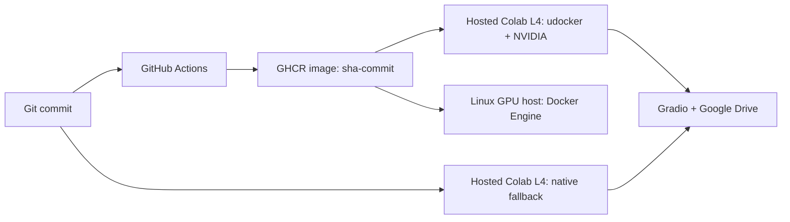

# Voice TTS: Colab L4 + Docker GPU

Проект даёт один интерфейс для персонального TTS: загрузить или записать разрешённый голос, ввести текст и получить WAV через CosyVoice 3. Один и тот же `app.py` используется в трёх режимах:

- hosted Google Colab L4 + `udocker` — канонический запуск опубликованного OCI/Docker-образа через один notebook;
- hosted Google Colab L4 + `native` — резервный запуск кода в изолированном Python 3.10;
- Linux NVIDIA Docker host — полноценный Docker Engine через `compose.yaml`.

Голоса и результаты не кладутся в Git. В Colab они сохраняются в `MyDrive/Voice TTS/`; если Google DriveFS временно недоступен, notebook продолжает работу в `/content/voice-tts-data` и предупреждает, что данные исчезнут вместе с runtime. В Docker используется примонтированный `runtime/data/`.

## Главное архитектурное ограничение

Hosted Google Colab не предоставляет поддерживаемый Docker daemon с NVIDIA Container Toolkit. Поэтому проект не маскирует nested Docker под рабочий контракт:

1. GitHub хранит единый исходный код.
2. GitHub Actions проверяет код, собирает Docker-образ и публикует неизменяемый тег `sha-<12 символов коммита>` в GHCR.
3. Colab клонирует выбранный Git-коммит и через `udocker` исполняет соответствующий OCI-образ на L4.
4. До открытия UI notebook проверяет CUDA внутри образа и загружает модель на Google Drive.
5. Если `udocker` несовместим с конкретным Colab runtime, переключатель `EXECUTION_MODE = "native"` запускает тот же код без контейнера.
6. На отдельном Linux GPU-сервере тот же образ запускается полноценным Docker Engine.

`udocker` не является Docker Engine и не даёт надёжной контейнерной изоляции: он извлекает и исполняет образ в пользовательском пространстве. В hosted Colab используйте его только с собственным доверенным публичным GHCR-образом. Вычисления на локальном Windows-ПК для этого workflow не требуются.



## Быстрый запуск в Colab

Канонический notebook:

`output/jupyter-notebook/voice_tts_colab_gpu.ipynb`

Порядок работы:

1. Создайте пустой GitHub-репозиторий `voice-tts`.
2. Загрузите туда этот проект.
3. Откройте notebook из GitHub через Google Colab.
4. Дождитесь успешного workflow **Validate and publish GPU image**.
5. В настройках GitHub Package сделайте GHCR package публичным.
6. Оставьте готовый `REPO_URL` либо замените его URL своего форка.
7. Оставьте `EXECUTION_MODE = "udocker"` и пустой `CONTAINER_IMAGE_OVERRIDE`.
8. Выберите `Runtime -> Change runtime type -> L4 GPU`.
9. Выполните ячейки сверху вниз и откройте временную ссылку Gradio.
10. После работы поставьте `STOP_APP = True`, выполните ячейку остановки и удалите Colab runtime.

Notebook сам:

- проверяет, что выделена L4;
- получает точный Git-коммит и вычисляет соответствующий GHCR-тег;
- пытается подключить Google Drive и безопасно переключается на временное хранилище при `mount failed`;
- в основном режиме устанавливает `udocker==1.3.17`, скачивает каждый OCI-слой с HTTP Range resume, проверяет его размер и SHA-256, импортирует archive через `udocker load` и выполняет `setup --nvidia`;
- проверяет `torch.cuda.is_available()` через приложение внутри образа;
- в резервном режиме создаёт отдельный Python 3.10 runtime;
- скачивает модель на Drive только при отсутствии весов;
- запускает Gradio в фоне;
- оставляет голоса и WAV в `MyDrive/Voice TTS/`.

Если получение manifest вернуло `manifest not found or not authorized`, либо workflow ещё не закончил сборку SHA-тега, либо GHCR package остался private. Не вставляйте GitHub token прямо в notebook: дождитесь сборки и настройте публичное чтение package. При обрыве большого blob notebook оставляет `.part`, получает новый временный URL и продолжает с сохранённого байта.

## Первая публикация в GitHub

В PowerShell из корня проекта:

```powershell
git init
git add .
git commit -m "Add Colab L4 and Docker GPU voice TTS"
git branch -M main
git remote add origin https://github.com/YOUR_USERNAME/voice-tts.git
git push -u origin main
```

Папки с голосами, runtime-данными и моделями исключены через `.gitignore`.

После push workflow `.github/workflows/docker.yml` выполняет CPU-safe проверки, собирает Docker-образ и публикует теги в:

```text
ghcr.io/YOUR_USERNAME/voice-tts
```

Для запуска из hosted Colab откройте GitHub Package settings и сделайте package публичным. Notebook по умолчанию использует не `latest`, а точный тег текущего коммита, например `sha-a1b2c3d4e5f6`, поэтому код и образ не расходятся.

## Веб-интерфейс

В UI доступны:

- загрузка аудиофайла;
- запись с микрофона в браузере;
- выбор ранее сохранённого голоса;
- Whisper-распознавание текста референса;
- поле текста для синтеза;
- скорость и seed;
- воспроизведение и сохранение готового WAV.

Для zero-shot voice cloning CosyVoice 3 нужен текст, произнесённый в референсе. Если поле оставить пустым, приложение запускает multilingual Whisper `base` и заполняет эту часть автоматически.

Рекомендуемый референс: 3-30 секунд чистой речи без музыки, эха и сильного шума.

## Docker GPU

Этот режим предназначен для Linux-машины с NVIDIA GPU, драйвером, Docker Engine, Compose и NVIDIA Container Toolkit. Согласно конфигурации Compose контейнер резервирует одну GPU.

Сборка и запуск:

```bash
cp .env.example .env
docker compose up --build
```

Перед запуском замените `GRADIO_PASSWORD` в `.env` на длинный случайный пароль. После старта откройте `http://HOST:7860` и войдите с `GRADIO_USERNAME` / `GRADIO_PASSWORD`.

Запуск опубликованного GHCR-образа без локальной сборки:

```bash
VOICE_TTS_IMAGE=ghcr.io/YOUR_USERNAME/voice-tts:latest docker compose up --no-build --pull always
```

Проверка GPU внутри запущенного контейнера:

```bash
docker compose exec app nvidia-smi
```

На локальном ПК пользователя эти команды в рамках подготовки проекта не выполнялись.

## Файлы проекта

- `app.py` — Gradio UI и пользовательский workflow.
- `voice_tts/core.py` — безопасные имена, библиотека голосов, metadata и проверки текста.
- `voice_tts/runtime.py` — CUDA, CosyVoice 3, Whisper, нормализация и генерация WAV.
- `Dockerfile` — Python 3.10/CUDA-образ с зафиксированным CosyVoice upstream.
- `compose.yaml` — GPU reservation, volumes и порт 7860.
- `scripts/bootstrap_colab.sh` — изолированная установка CosyVoice в hosted Colab.
- `scripts/pull_oci_resumable.py` — возобновляемая загрузка и криптографическая проверка публичного GHCR OCI-образа.
- `scripts/build_colab_notebook.py` — воспроизводимая сборка канонического notebook без сохранённых output.
- `output/jupyter-notebook/voice_tts_colab_gpu.ipynb` — единый notebook управления.
- `.github/workflows/docker.yml` — проверка и публикация образа в GHCR.

## Версии

- Модель: `FunAudioLLM/Fun-CosyVoice3-0.5B-2512`, revision `29e01c4e8d000f4bcd70751be16fa94bf3d85a18`.
- CosyVoice upstream зафиксирован на commit `074ca6dc9e80a2f424f1f74b48bdd7d3fea531cc`.
- Docker base: `nvidia/cuda:12.1.1-cudnn8-runtime-ubuntu22.04`; официальный CosyVoice requirements устанавливает PyTorch 2.3.1 CUDA 12.1.
- Gradio: `5.4.0`, согласованный с официальным `requirements.txt` CosyVoice.
- Build toolchain: `pip==25.3`, `setuptools==80.9.0`, `wheel==0.45.1`; старый Whisper собирается отдельно без build isolation, чтобы новая версия pip не ломала закреплённый upstream.

Официальные источники: [CosyVoice](https://github.com/FunAudioLLM/CosyVoice), [модель CosyVoice 3](https://huggingface.co/FunAudioLLM/Fun-CosyVoice3-0.5B-2512), [Docker Compose GPU](https://docs.docker.com/compose/how-tos/gpu-support/), [Colab local runtimes](https://research.google.com/colaboratory/local-runtimes.html), [udocker user manual](https://github.com/indigo-dc/udocker/blob/master/docs/user_manual.md).

## Безопасность и согласие

Используйте только собственный голос либо голос, на использование которого есть явное разрешение. Не применяйте проект для мошенничества, выдачи себя за другого человека или создания вводящих в заблуждение материалов. UI требует явного подтверждения согласия перед распознаванием и генерацией.

## Граница проверки

На Windows-ПК выполняются только чтение файлов, CPU-safe unit-тесты и статическая проверка Python/notebook JSON. Docker, `udocker`, CUDA, скачивание модели и синтез речи должны проверяться только в удалённом Colab L4 или на отдельном NVIDIA Docker host.
